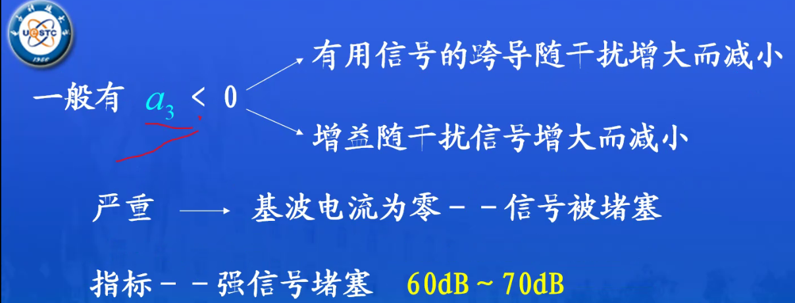

# 第三次课

## 非线性器件描述法

### 解析函数表示法

### 级数法

### 参数线性化法

## 1dB 压缩点的近似公式

式中的 $a_1, a_3$ 表示非线性伏安关系的一次项系数与三次项系数。

## 堵塞现象

一般我们在讨论系统抗干扰性能时，提及“强阻塞条件”，

一般就是指信干比达到 -60dB ~ -70dB。

## 交调和互调

### 交调（Cross Modulation）

AM 容易见到这种情况。干扰频率的幅度窜入到有用信号的幅度上。

实例：AM 广播中听到其他频道的声音混入当前频道中。

### 互调（Intermodulation）

互调是一个频率概念。它指的是落在有用频带内的组合频率无用边带。

