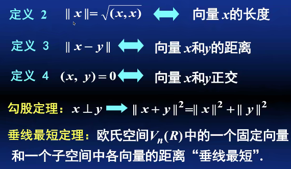

# 第三次课

## 复习：定义内积

定义一种映射，将线性空间上的两个向量映射为该线性空间所在数域中的一个数（**向量变成数**）：

1. 恒为非负，当且仅当输入的两个向量都是 0，才映射到 0；（**正定性**）
2. 交换两个操作向量，则映射到原得数的共轭；（**共轭对称性**）
3. 数乘第一个操作向量，则映射到该数的共轭对原得数的数乘；（对第一个操作向量 **共轭线性**）
4. 分配律。

满足上述 4 条性质的映射，就叫“内积”。

从 3 可以推论出：

1. 数乘第二个操作向量，则映射到该数对原得数的数乘（对第二个操作向量 **线性**）

## 定义内积有什么目的

1. 定义 **长度**
2. 定义 **夹角**

## 内积的举例

1. （有限维空间上的内积）$\mathbb C^n$ 上定义内积 $$(\alpha,\beta)=\alpha^{\rm H}\beta$$
2. （无穷维空间上的内积）闭区间 [a,b] 上连续的函数空间上，定义内积 $$(f,g)=\int _a^b f(x)g(x)dx$$

## 欧式空间的基本性质与定理

此外还有平行四边形法则：

总要确保平行四边形的对角线平方和，等于四条边长的平方和。

柯西-施瓦兹不等式：向量的内积不大于两向量模的积

三角不等式：向量和的模不大于两向量模的和
