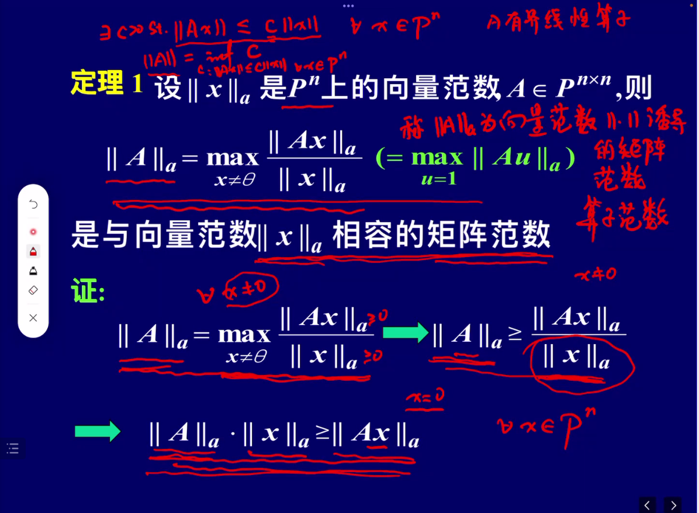

# 第五次课

## 范数的相容性

书上提及矩阵的 $m_2$ 范数有相容性，但实际上，$m_2$ 范数是不相容的，书上在平方和展开时漏掉了一个 2 倍的系数，导致了错误。

## 算子范数

若在 $P^n$ 上定义了向量范数，在 $P^{n\times n}$ 上定义了矩阵范数

### 算子范数的性质

1. 它是所有与某个向量范数相容的矩阵范数全体中最小的。
2. 它有两种表达形式：$$||A||_a=\max_{x\neq0}\frac{||Ax||_a}{||x||_a}=\max_{||u||=1}||Au||_a$$
3. 算子范数是自相容的矩阵范数。
4. 