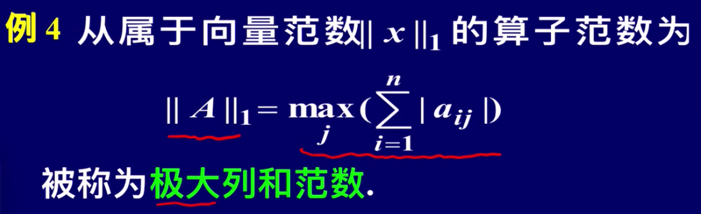
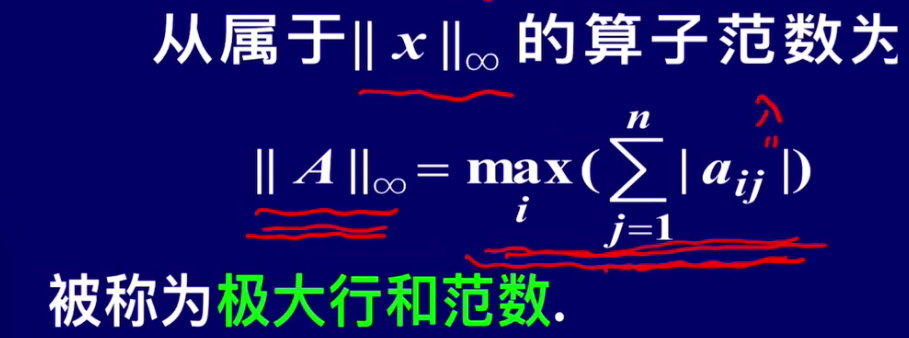
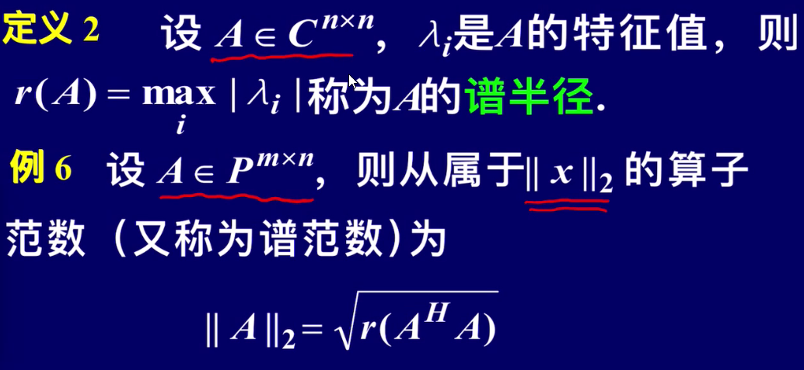
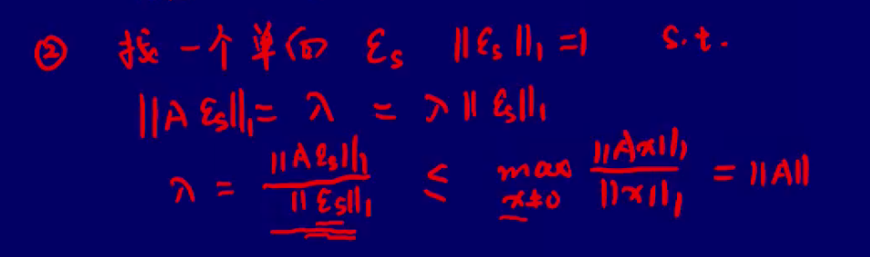
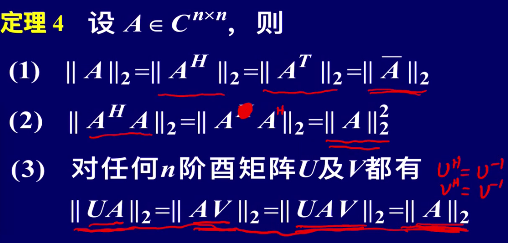
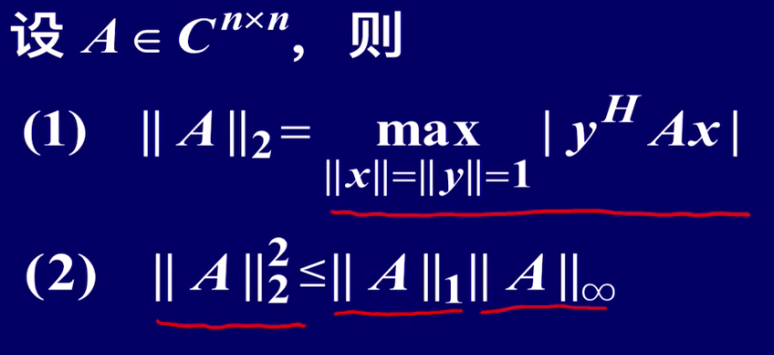

# 第六次课

## 算子范数的定义

$\frac{||Ax||}{||x||}=||A||$

这里随着 x 的向量范数定义不同，算子范数的定义也不同。

后者称为由前者诱导的。

## 求算子范数的通用步骤

1. 求证的算子范数形式，令为一常数 $\lambda$。
2. 先证明 $||Ax||\leq\lambda||x||$，故 $\frac{||Ax||}{||x||}=||A||\leq\lambda$
3. 再构造一个范数为 1 的特殊单位向量 $\varepsilon$，
   
   使得 $||A\varepsilon||=\lambda=\lambda||\varepsilon||$
4. 那么，$||A||\leq\lambda=\frac{||A\varepsilon||}{||\varepsilon||}\leq \max _{x \neq 0}\frac{||Ax||}{||x||}=||A||$，
   既不大于又不小于，只能等于。

## 谱范数的性质

