# 非线性微波电路与系统 - 第七次课

## 电桥耦合的电路组件特性

### 180° 电桥
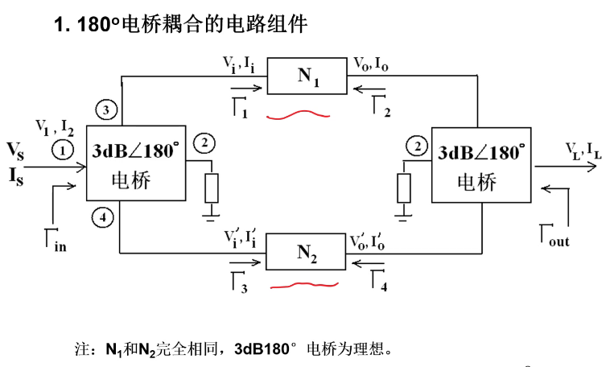

这种构造不会改变电路的增益。

假如 N1 和 N2 增益都为 G，

那么系统的总增益仍为 G。

但是这种构造，

可以使系统的饱和功率，

为各支路的饱和功率总和（功率合成）

同时，可以提高 ${\rm IP}_n$，改善线性度；

此外，180° 电桥可以抵消偶次谐波。

但是，180° 电桥的端口反射是没有改善的。

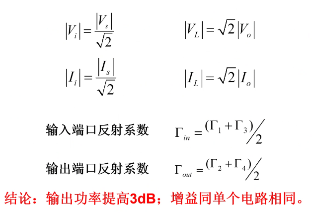

### 90° 电桥

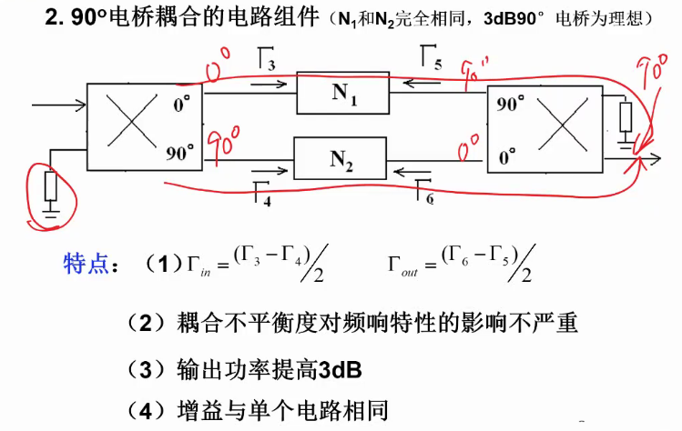

如果能确保 N1 和 N2 对称，

那么这一电路可以改善输入和输出端口的端口反射。

可以使系统的饱和功率为各支路的饱和功率总和；

可以提高 ${\rm IP}_n$，改善线性度。

这种构造同样不会改变电路的增益。

## 非理想平衡的影响

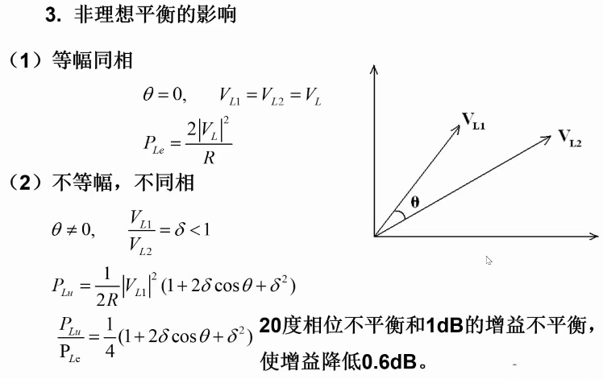

## 抑制谐波和交调的能力

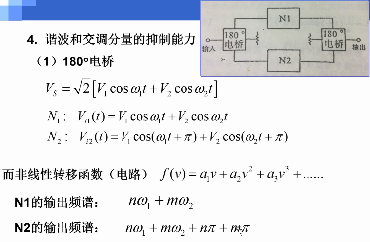

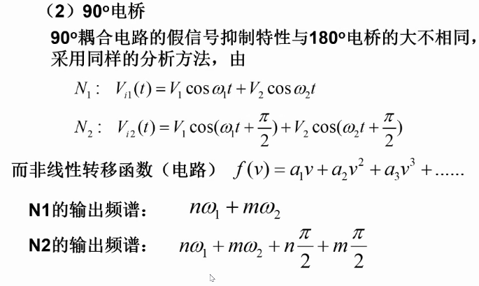

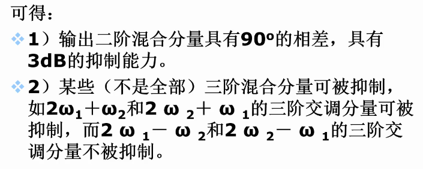

## 不用电桥，用直连的元件构建平衡电路

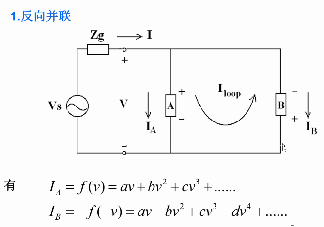

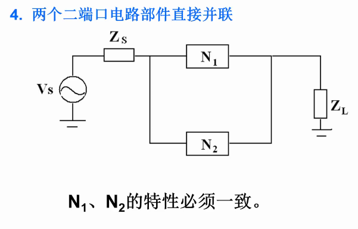

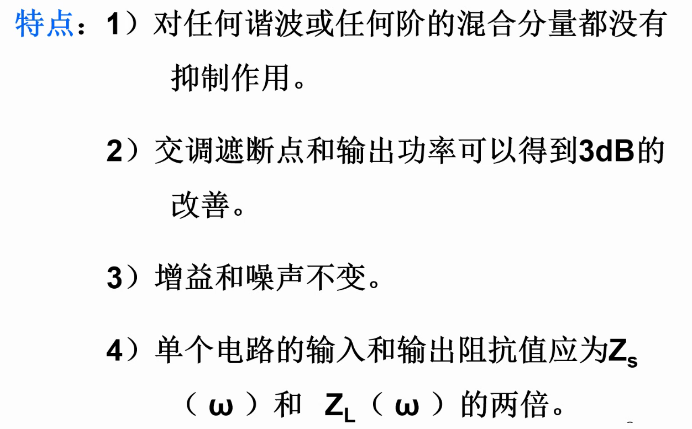

如果扩展到 m 个支路直接并联：

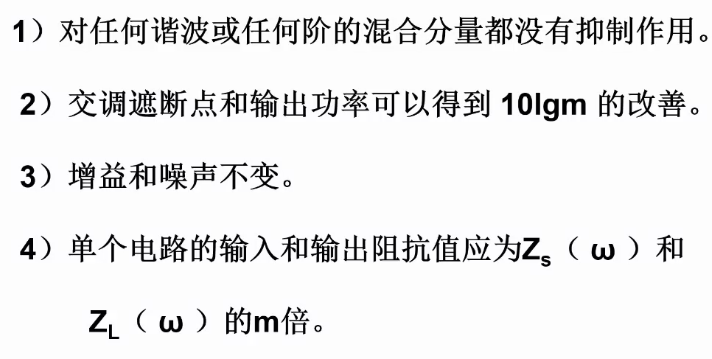

## 放大器理论

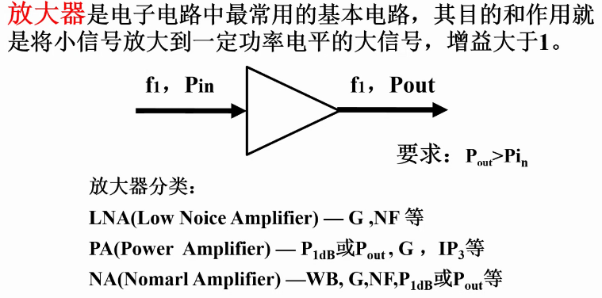

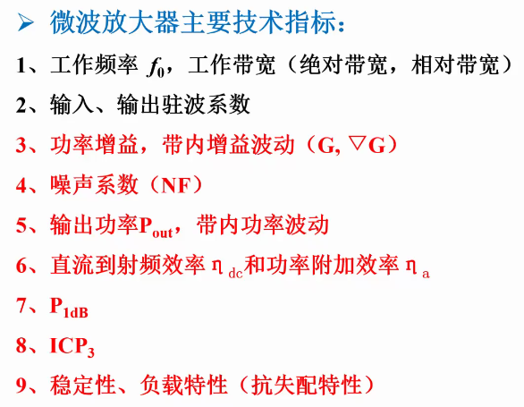

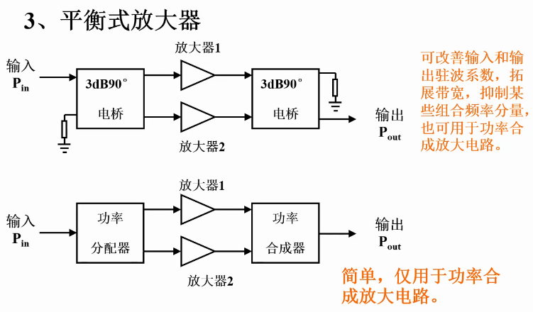

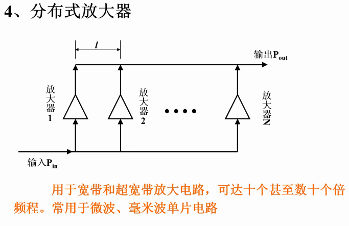