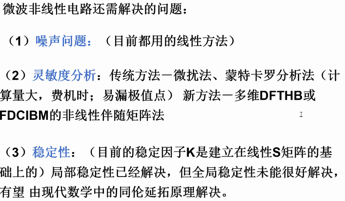

# 第五次课

## 幂级数分析法的局限性

不允许电路中存在记忆性元件，例如非线性电容。

Volterra 级数法则没有这个限制。

## 阶数和次数的差别

次就是幂次。

阶是次数之和，比如两个一次项频率组合产生的是二阶项。

## （交调）遮断点与功率关系

用幅度相等，频率接近的两个频率来激励电路（双频 / 双音测试）。

用频谱仪观察输出频谱。

### 交调分量功率公式

#### 二阶交调

#### 三阶交调

#### 增量性质

输入每增加 1 dB：

二阶交调增长 2 dB，三阶交调增长 3 dB，n 阶交调增长 n dB。

### 遮断点的定义

遮断点按照输入、输出，成对出现：

${IIP}_n$ 表示 n 阶输入交调遮断点，

${IOP}_n$ 表示 n 阶输出交调遮断点。

它们按照阶数配对，

组成线性输出功率与交调输出功率线性外推交点的坐标。

因此，它们的量纲和功率是一样的。

遮断点和输入功率是无关的；它是由器件的特性确定的。

因此在衡量器件的交调性质时，用遮断点来比较。

遮断点的高度越高，器件的线性度越好。

### 遮断点的计算

## 交调系数

$${IM}_n \overset{\rm def}{=} 10 \lg \frac{P_{IM}}{P}$$

式中 P 是基波功率，$P_{IM}$ 是感兴趣的阶数的交调功率。

遮断点的概念只能直接用在双频激励的情况下，我们假设了激励信号的电平是同步变化的，才能确定功率的关系式。

如果只有某一个频率 $\omega _i$ 的电平变化，其余激励功率电平不变，则交调输出电平的变化率会降低为变化的那个电平在频率组合中的系数。

比如三阶交调分量 $2\omega _1-\omega _2$，若频率 2 电平不变，则变化率降低到 2 dB/dB；若频率 1 电平不变，则变化率降低到 1 dB/dB。

## 器件的并联和级联如何影响遮断点

1. 相同部件并联或混联，输出遮断点增加 $10\lg M$ dB，输出功率也增加 $10\lg M$ dB，M是部件的个数。
 
   这就可以推出一些常用结论，
   
   比如并联一个加 3dB
   
   （线性值 2 -> 3dB）。
2. 考虑任意的部件级联，且交调分量全部同相叠加

## Volterra 分析法

其实就是不做线性与非线性的拆分了。

## 非线性电流法

## 4.2.6 节

自学内容

## 补充内容：非线性电路分析理论新进展

了解即可。

## 补充：自激

电路通电，尚未输入时，电路即产生信号输出，

这个现象就称为自激，

输出的信号就是自激信号。

自激信号可能产生在任何的频率，

总应当规避自激现象。

## 第一次作业

技术报告：**微波非线性电路理论的新发展趋势**
