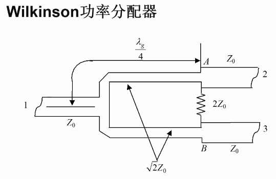

# 非线性微波电路与系统 - 第六次课

## 本节内容

第五章 - 平衡和多器件电路

## 平衡电路的优点

弥补单个电路输出功率、动态范围的不足，

改善带宽、输入输出驻波系数，

部分抵消单个电路无法滤除的谐波与交调分量。

## 理想的微波电桥特性

### 3dB 180° 电桥（魔T）


### 3dB 90° 电桥


### 0dB 电桥

典型实例：Wilkinson 功分器



它的 S 参数 `dB(S(2,3))`，可以表示其隔离度。

### 不等分 Wilkinson 功分器


### N 路 Wilkinson 功分器


## 耦合器

### 耦合器的分类


### 直接式定向耦合器


#### 常用的性能表征参数


#### 常用的设计：微带定向耦合器


该设计中，输入和输出的相位相差 90°，因此它也是一种 90° 电桥。

#### 通过 S 参数观察耦合器性能


从 **耦合端口 S 参数的幅度（图 1）** 可以观察出，它的耦合度是比较差的。

#### 限制微带耦合器耦合度的因素

构成耦合器的两条平行微带线之间的缝宽越窄，耦合度就会越好。

然而，PCB 工艺只能把缝宽做到 0.1mm，制约了其耦合度进一步提高。

但是，低耦合度的耦合器并非没有用处，例如用于从信号的主要通路上，耦合极小部分的功率用于检波。

### 分支线耦合器


#### 简单分析分支线耦合器

怎么看出 90° 相位差：


1-3 路线多走了 $\frac{\lambda_g}{4}$，所以产生了 90° 相位差。

#### 分支线耦合器的布线优势

微波电路布板时，尽量顺序级联。

一定要转弯时，转直角弯，尽量不转弯。

不到万不得已，不设计回头的线路，以避免来回两条线路相互耦合。

因此，将输出端放在同一侧的分支线耦合器是便于需要级联的微波电路布板的。

### Lange 耦合器


简单说来就是，

```
微带AAAAA
微带BBBBB
微带AAAAA
微带BBBBB
```
其中两条微带 A 彼此导通，两条微带 B 彼此导通。

这样，能够产生耦合的边缘就增加了，耦合度就提高了；

同时这种设计还不会过度增加耦合器的面积。

但缺点是，更窄的耦合线和微带间的连接跳线都会增加 PCB 加工难度。

所以它很容易应用在没有 PCB 工艺问题的 **芯片设计** 当中。

PCB 板上，跳线用 25 微米的金丝来实现。

芯片中则采用打孔来实现。

#### 两种 Lange 耦合器构造


与之相对的是非折叠构造


后者的耦合端口和输入端口在同侧，会制造布板困难，用得较少。

### 混合环耦合器


改进方向：**缩小其面积**。

一般使用它的反相工作模式。

#### 利用 S 参数分析混合环性能


